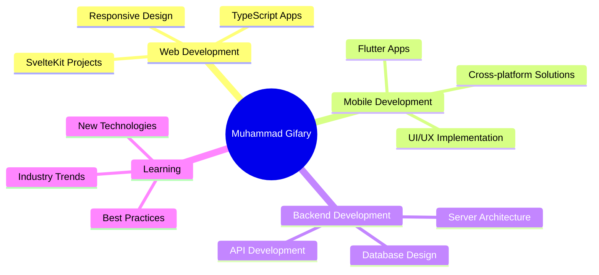

#  Hi there, I'm Muhammad Gifary

<div align="center">
  
</div>

<div align="center">
  
</div>

<br>

<div align="center">
  
</div>

---

## 🚀 About Me

```typescript
const muhammadGifary = {
    pronouns: "He/Him",
    location: "Indonesia 🇮🇩",
    role: "Full Stack Developer",
    languages: ["TypeScript", "PHP", "Java", "Dart"],
    frameworks: ["Flutter", "SvelteKit", "Laravel", "Spring Boot"],
    databases: ["MySQL", "PostgreSQL", "MongoDB"],
    currentFocus: "Building scalable mobile and web applications",
    funFact: "I debug with console.log() and I'm not ashamed! 😄"
};
```

---

## 🛠️ Tech Stack & Tools

<div align="center">

### 💻 Programming Languages


### 🎨 Frontend Development


### ⚡ Backend Development


### 📱 Mobile Development


### 🗄️ Databases


### 🔧 Tools & Others


</div>

---

## 📊 GitHub Analytics

<div align="center">
   
  
</div>

<div align="center">
  
</div>

<div align="center">
  
</div>

---

## 🏆 GitHub Trophies

<div align="center">
  
</div>

---

## 🐍 Contribution Snake

<div align="center">
  
</div>

---

## 💼 What I'm Working On

<div align="center">



</div>

---

## 🌟 Featured Projects

<div align="center">
  <a href="https://github.com/gifary500D">
    
  </a>
  <a href="https://github.com/gifary500D">
    
  </a>
</div>

---

## 📈 Coding Activity

<!--START_SECTION:waka-->
<!--END_SECTION:waka-->

---

## 🎯 2024 Goals

- 🚀 Build 5 production-ready Flutter applications
- 📚 Master advanced TypeScript patterns
- 🌐 Contribute to 10+ open source projects
- 📱 Launch my first mobile app on Play Store
- 🎨 Improve UI/UX design skills

---

## 📫 Let's Connect!

<div align="center">

[](mailto:gifary024@gmail.com)
[](https://my-portofolio-ivory-two.vercel.app)
[](#)
[](#)

</div>

---

<div align="center">
  
### Show some ❤️ by starring some of the repositories!


</div>

<div align="center">
  
</div>

---

<div align="center">
  <i>⚡ "Code is like humor. When you have to explain it, it's bad." – Cory House</i>
</div>
